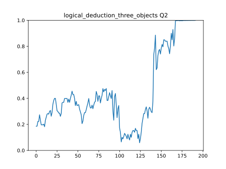
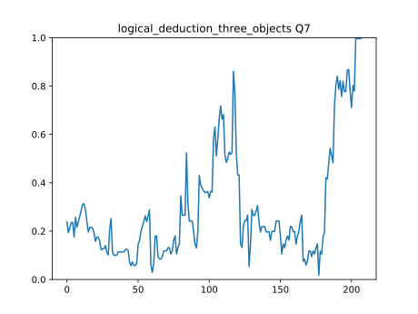

# Analysis Results

## Logical Deduction Three Objects

### Question 2

To solve this, let's analyze the information given:

1. The blue book is the rightmost.
2. The orange book is the leftmost.

From these two statements, we can conclude that the order of the books from left to right is: orange,?, blue.

Now, let's examine the options:

(A) The blue book is the second from the left: This would mean the order is orange, blue,?, which contradicts the given information that the blue book is the rightmost.

(B) The orange book is the second from the left: This would mean the order is?, orange, blue, which also contradicts the given information that the blue book is the rightmost.

(C) The red book is the second from the left: This would mean the order is?, orange, blue, which is consistent with the given information that the blue book is the rightmost.

Therefore, the correct answer is:

ANSWER: C

---

### Question 7

To solve this problem, let's analyze the information given in each paragraph.

Paragraph 1: 
There is no information about the order of the golfers in this paragraph.

Paragraph 2:
- Rob finished below Mel.
- Mel finished below Eve.

From this, we can conclude that Mel finished above Rob and Eve.

Now, let's look at the options:

(A) Eve finished first
- This is possible, but we can't confirm it yet.

(B) Rob finished first
- This is not possible, as Rob finished below Mel, and Mel finished below Eve.

(C) Mel finished first
- This is also possible, but we can't confirm it yet.

However, we can combine the information from both paragraphs. Since Mel finished above Rob and Eve, and Rob finished below Mel, it means that Mel must be above both Rob and Eve. Therefore, Mel cannot be first, as Eve must be above Mel.

So, the only option that is consistent with the information given is:

(A) Eve finished first

---
